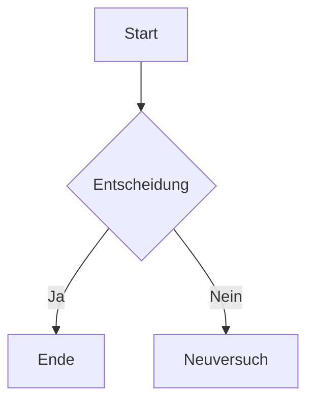
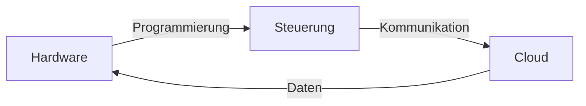

# wago-howto-theme

Jekyll theme für WAGO HowTo-Dokumentation mit umfangreicher Unterstützung für Markdown, Diagramme und Mehrsprachigkeit.

## Features

- 📱 **Responsive Design** basierend auf Bootstrap 4
- 🌐 **Mehrsprachig** (Deutsch, Englisch)
- 📊 **Mermaid-Diagramme** (Flowcharts, Sequence-Diagramme, Gantt-Charts, etc.)
- 📐 **MathJax** für mathematische Formeln
- 🎯 **Sidebar-Navigation** mit Table of Contents
- 🔗 **Relative Links** und URL-Redirects
- 😊 **Emoji-Support**

## Mermaid-Diagramme

Diese Theme unterstützt [Mermaid](https://mermaid.js.org/)-Diagramme in Markdown.

### Verwendung

Schreibe deine Diagramme in Fenced Code Blocks mit `mermaid` Language-Tag:

````markdown

````

### Unterstützte Diagrammtypen

- **Flowcharts** und Diagramme (`graph`, `flowchart`)
- **Sequence-Diagramme**
- **Gantt-Charts**
- **Class-Diagramme**
- **State-Diagramme**
- Und viele weitere — siehe [Mermaid-Dokumentation](https://mermaid.js.org/)

### Beispiel



See [here](https://pages.svgithub01001.wago.local/education/wago_howto_theme/)...
