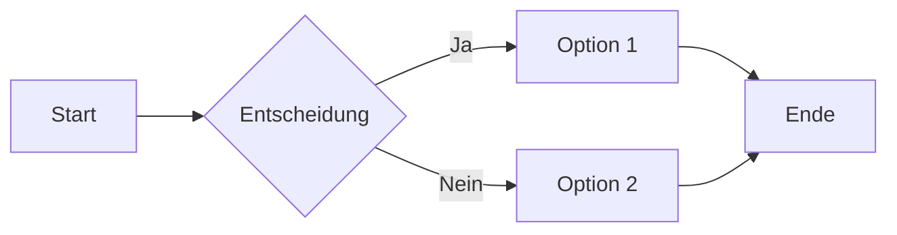
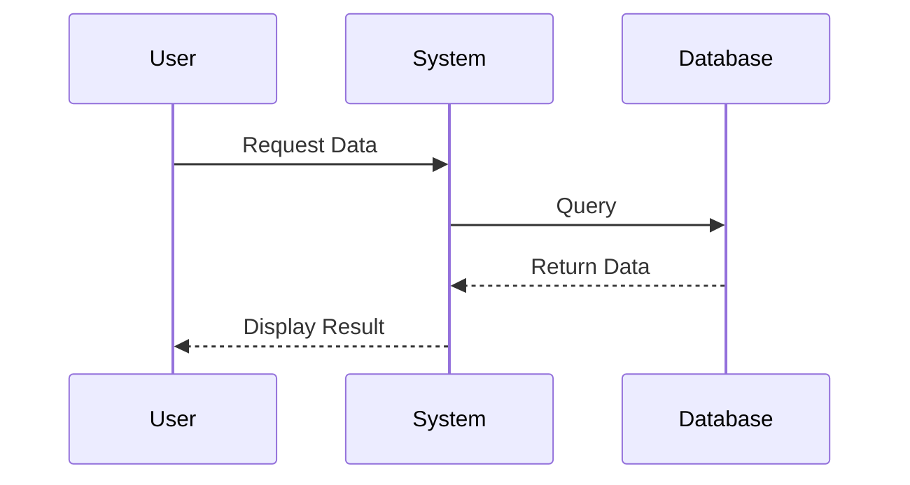
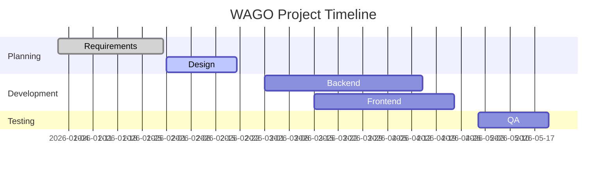
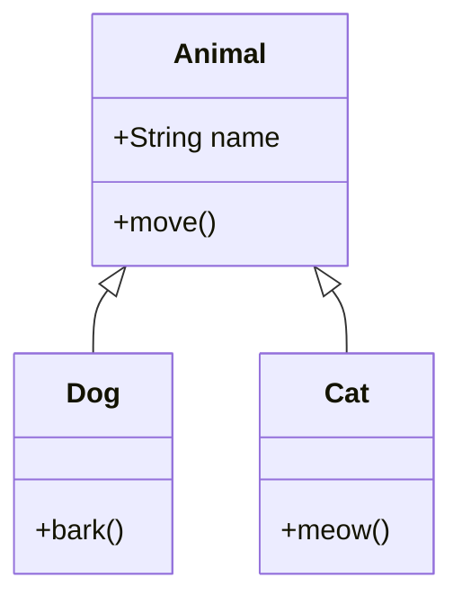
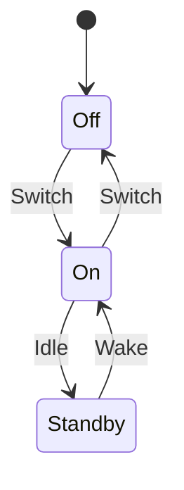

# Mermaid Diagram Examples

Dies ist eine Test-Seite um Mermaid-Diagramme zu demonstrieren.

## Flowchart Example

```mermaid
flowchart LR
    A[Start] --> B{Entscheidung}
    B -->|Ja| C[Option 1]
    B -->|Nein| D[Option 2]
    C --> E[Ende]
    D --> E
```

## Sequence Diagram

```mermaid
sequenceDiagram
    participant User
    participant System
    participant Database
    User->>System: Request Data
    System->>Database: Query
    Database-->>System: Return Data
    System-->>User: Display Result
```

## Gantt Chart

```mermaid
gantt
    title WAGO Project Timeline
    dateFormat YYYY-MM-DD
    
    section Planning
    Requirements     :done, plan1, 2026-01-01, 30d
    Design          :active, plan2, 2026-02-01, 20d
    
    section Development
    Backend         :dev1, 2026-03-01, 45d
    Frontend        :dev2, 2026-03-15, 40d
    
    section Testing
    QA              :test1, 2026-05-01, 20d
```

## Class Diagram

```mermaid
classDiagram
    class Animal {
        +String name
        +move()
    }
    class Dog {
        +bark()
    }
    class Cat {
        +meow()
    }
    Animal <|-- Dog
    Animal <|-- Cat
```

## State Diagram

```mermaid
stateDiagram-v2
    [*] --> Off
    Off --> On: Switch
    On --> Off: Switch
    On --> Standby: Idle
    Standby --> On: Wake
```
